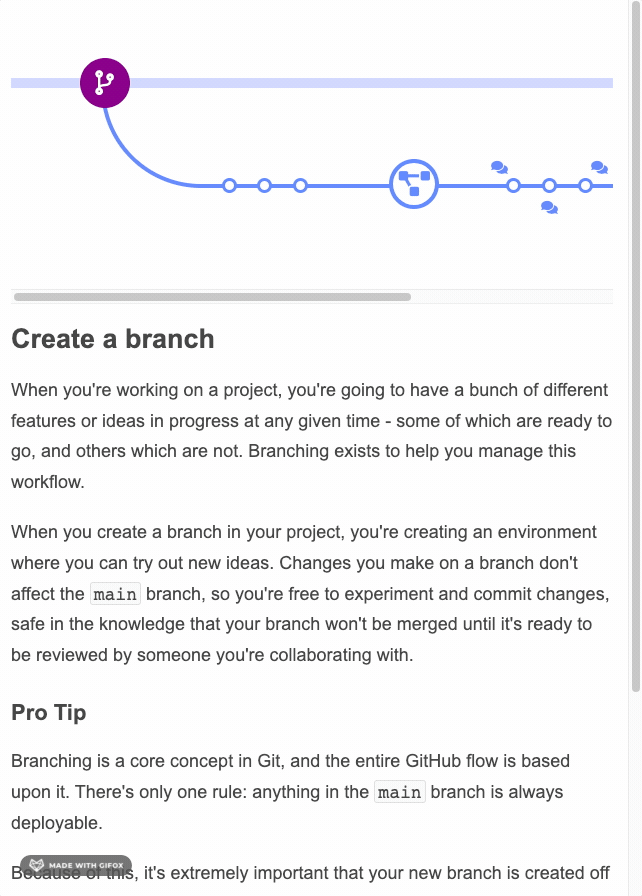

# dynamic-gallery
This was inspired by an old GitHub diagram that can be seen [here](https://web.archive.org/web/20210301202302/https://guides.github.com/introduction/flow/) via the [Internet Archive](https://web.archive.org/).

## Finished Product

### It's also responsive:

## Lessons Learned
* Dynamically adding classes to elements can make working with attribute selectors a little more complex. For example, I assigned a `.disabled` class to some elements, causing a CSS ruleset to be ignored for that element. `[class$="arrow"]` won't work because the class is now a space-separated class list and doesn't end in that value --but `[class*="arrow"]` will work here.
* Functions declared with the `function` keyword have an `arguments` object that can be accessed in the body to iterated through the arguments passed on invocation. Arrow functions do not have this. A preferable way of accessing the arguments is via the rest parameter.
* A CSS declaration of `white-space: nowrap;` prevents text inside `<code>` elements from spanning multiples lines, keeping the text together. This just looks better.
* An "array-like" object is one that has a `length` property and whose properties are indexed from 0, but it doesn't have Array's built-in methods, e.g. `forEach`.
* The DOM's APIs can return different types of objects, none of which are arrays:
  * An object of type `NodeList` will contain all nodes, including text nodes and comment nodes, which you may not want: `document.body.childNodes`.
  * An object of type `HTMLCollection` contains only HTML elements, which is more often what you will want when querying the DOM: `document.body.children`.
  * An object of type `DOMTokenList` represents a set of space-separated tokens: `someElement.classList`.
    *  Using a DOMTokenList in a string produces a string of space-separated tokens rather than `"[object DOMTokenList]"`.
